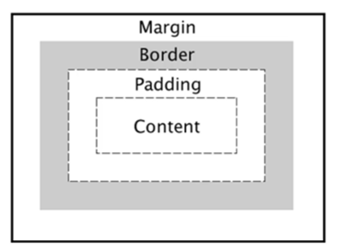

# Welcome to the Full Stack Web Development course with Python/Django.

# HTML Resources
Mozilla MDN is like a user-friendly manual for web developers, offering clear explanations and examples for web technologies like HTML, CSS, and JavaScript. It's a go-to resource for building and improving websites, maintained by Mozilla, the creators of Firefox. To learn more visit https://developer.mozilla.org/en-US/

# CSS Reources 
Cascading Style Sheets (CSS) is a language used to style and design the visual presentation of web pages. It's like the "clothing" for a website, determining how the content looks and is displayed on the screen. To learn more visit https://www.w3schools.com/css/css_intro.asp and https://www.w3schools.com/cssref/css_selectors.php for CSS selectors.

# Typefaces for Windows/Mac
To learn more about available fonts visit https://coderwall.com/p/57imrw/common-fonts-for-windows-mac and the font stack that provides all the web safe css fonts https://www.cssfontstack.com/. https://fonts.google.com/ will allow you to grab font you may want to use on your own application by embeding fonts.

# CSS Model
The basic box model allows web developers to precisely dictate how they want HTML elements to look. 

 **Pic 1.** *Image displaying the box Model*  

 **Pic 2.** *Image displaying hos spacing is used between each side*     border: 4px solid blue;
