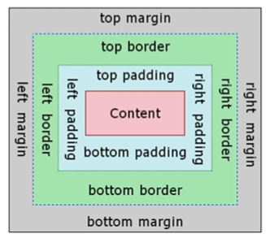

# Welcome to the Full Stack Web Development course with Python/Django.

# HTML Resources

Mozilla MDN is like a user-friendly manual for web developers, offering clear explanations and examples for web technologies like HTML, CSS, and JavaScript. It's a go-to resource for building and improving websites, maintained by Mozilla, the creators of Firefox. To learn more visit https://developer.mozilla.org/en-US/

# CSS Reources

Cascading Style Sheets (CSS) is a language used to style and design the visual presentation of web pages. It's like the "clothing" for a website, determining how the content looks and is displayed on the screen. To learn more visit https://www.w3schools.com/css/css_intro.asp and https://www.w3schools.com/cssref/css_selectors.php for CSS selectors.

# Typefaces for Windows/Mac

To learn more about available fonts visit https://coderwall.com/p/57imrw/common-fonts-for-windows-mac and the font stack that provides all the web safe css fonts https://www.cssfontstack.com/. https://fonts.google.com/ will allow you to grab font you may want to use on your own application by embeding fonts.

# CSS Model

The basic box model allows web developers to precisely dictate how they want HTML elements to look. 

 **Pic 1.** _Image displaying the box Model_  

 **Pic 2.** _Image displaying hos spacing is used between each side_ border: 4px solid blue;

# Bootstrap 4.x

Bootstrap is an open-source front-end framework developed by X (Twitter). It provides a set of pre-designed and pre-built components, such as navigation bars, buttons, forms, and more, to help developers create responsive and visually appealing web pages quickly and easily.
To use Bootstrap in a project, developers can include the Bootstrap CSS and JavaScript files in their HTML documents or use a content delivery network (CDN). To learn more visit https://getbootstrap.com/docs/4.0/getting-started/introduction/.

- Bootstrap is a popular front-end framework that simplifies the process of designing and developing responsive websites. One of the key features of Bootstrap is its grid system, which allows you to create flexible and responsive layouts. **_The grid system is based on a 12-column layout and is mobile-first_**, meaning it's designed to work well on smaller screens and then scale up for larger screens.
- The Bootstrap v4.4 CDN is located on this site 
https://getbootstrap.com/docs/4.4/getting-started/introduction/

# Javascript
JavaScript is a versatile, high-level programming language primarily used for web development. It enables dynamic manipulation of web page content and has expanded its use to server-side development (Node.js) and mobile app development (React Native, Ionic). JavaScript features C-style syntax, supports various data types, emphasizes functions, excels in asynchronous programming, and interacts with the Document Object Model (DOM) for web page manipulation. Its ecosystem includes libraries and frameworks like jQuery and React, and it has evolved with updates such as ECMAScript 6 (ES6) for enhanced syntax and features. Security considerations, including issues like cross-site scripting (XSS), are important in web development using JavaScript. To learn more visit https://developer.mozilla.org/en-US/docs/Web/JavaScript

# Document Object Model (DOM)

The Document Object Model (DOM) is a vital concept in web development, representing the hierarchical structure of HTML or XML documents. It enables dynamic interaction through JavaScript, allowing developers to modify document content, structure, and style. The DOM's tree structure, dynamic capabilities, and event handling contribute to creating responsive and interactive web applications, ensuring cross-browser compatibility. Understanding the DOM is crucial for developers to bridge static document structures with dynamic scripting, enhancing the overall user experience. To learn more visit https://developer.mozilla.org/en-US/docs/Web/API/Document_Object_Model 

- **_FYI_**: The reason it was recommended to put "script" tags at the end of the "body" was so the "script" wouldn’t stop the browser from parsing the HTML. When a browser gets to a "script" tag it stops everything else and loads the file for that "script" tag and then evaluates it. Thus, if you put the "script" tag in the "head" or at the beginning of the "body" then the user would have to wait longer for the HTML to render possibly leaving them staring at a blank page for a while.
