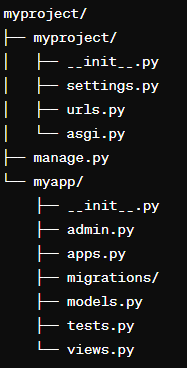

# Welcome to DJANGO

Django is a high-level web framework for building web applications in Python. It follows the MVC architectural pattern, emphasizing rapid development and clean design. Key features include an ORM for database interaction, a built-in admin interface, URL routing, a template engine, forms system, and robust security measures. Django simplifies common web development tasks, making it suitable for various projects, from simple websites to complex applications.

***Key features and components of Django include:***
- **ORM (Object-Relational Mapping):** Django provides a powerful and customizable ORM system that allows developers to interact with databases using Python code. This makes it easier to work with databases and helps in creating database-independent code.
- **Admin Interface:** Django comes with a built-in, auto-generated admin interface that allows developers to perform CRUD (Create, Read, Update, Delete) operations on the application's models without having to create a separate admin panel.
- **URL Routing:** Django uses a URL routing system that maps URLs to views. This makes it easy to organize the structure of a web application and handle different HTTP methods (GET, POST, etc.).
- **Template Engine:** Django includes a template engine that allows developers to write dynamic HTML templates with Django template language. It facilitates the separation of logic and presentation in web applications.
- **Forms:** Django provides a forms system that simplifies the process of handling user input, data validation, and rendering HTML forms.
- **Security:** Django is designed with security in mind and provides protection against common web vulnerabilities. It includes features such as protection against Cross-Site Scripting (XSS), Cross-Site Request Forgery (CSRF), SQL injection, and more.
- **Middleware**: Django uses middleware components that process requests and responses globally. Middleware allows developers to add functionality to the request-response process, such as authentication, logging, or custom processing.
- **Authentication and Authorization:** Django includes a robust authentication system with support for user management, permissions, and groups. It also provides built-in support for OAuth and other authentication providers.
- **REST Framework:** While not part of the core Django framework, the Django REST framework is a powerful and flexible toolkit for building Web APIs. It is commonly used for developing RESTful APIs with Django.

In Django, a project and an application serve different purposes and have distinct roles in the overall structure of a web application.
- Django Project:
    - A Django project is the entire web application or website. 
    - It represents the entire web application and contains all the settings, configurations, and top-level components. 
    - A project typically includes multiple applications, each serving a specific functionality. 
    - It is created using the django-admin startproject command.
- Django Application:
    - A Django application is a self-contained module within a Django project that performs a specific functionality. 
    - It consists of models, views, templates, and other components that work together to achieve a specific purpose. 
    - Applications are designed to be reusable and can be plugged into different projects if needed.
    - An application is created using the python manage.py startapp command
    

    